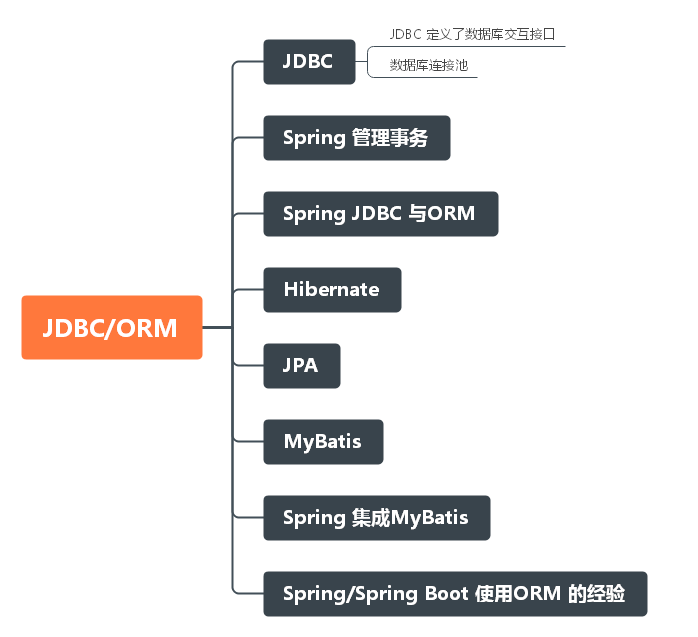
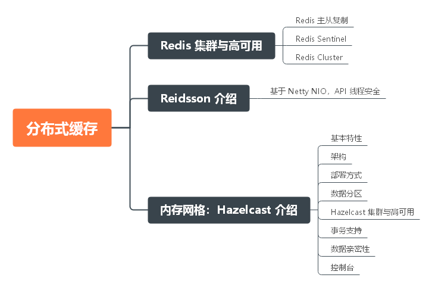

# 毕业总结

## 前言

其实回想起我第一次看见秦大哥这个训练营的时候，我一开始是拒绝的！因为我本来就对这些培训班不是很信任，而且你告诉我三个月进化成 P7 老子是不相信的！但是最后我还是报名了，为什么？第一，我对自己的技术渴望一个快速的成长，我感觉光靠自己难以实现；第二，谭超老师的算法课程给了我不错的印象；第三，老师的资历打动我了， Apache 顶级项目的 PMC，这是外面的培训机构很难见到的，除非是一些价格上万的课程。所以，我还是报名了，因为我觉得三个月不行，那我可以用更多的时间啊。

到了真正上课的时候，也确实如我所想的那样，想短时间内消化秦老师的所讲的知识点，简直就是不可能的，况且从学习到实践中间还需要很多路要走呢。所以一开始的时候，我就把课程的学习的时间周期拉长了很多，也许训练营结束了，但是我们学习还不能结束！而且秦老师后面把挑战作业的有效期延期到了一年后，我也更加坚定了我这个想法。

三个月以来，训练营给我最大的收获有三点：训练营热情的学习氛围；老师和助教的技术和职业经历给我们的指点；老师能带我们接触开源。

所以，总的来说训练营对我来说还是非常值得的！

## JVM

JVM 主要包括 JVM 和 字节码技术，这涉及到 java 语言的底层实现和运行环境。相对于其他 热门技术，JVM相关技术在工作中直接使用的机会不会很多，但是如果对于想进阶的程序员来说，这是一项必须掌握的技术，同时也是大厂面试中的重点。

重点掌握：

- 字节码：了解字节码基本指令；掌握一个以上有名字节码工具的使用，比如：CGlib、Javassist等
- JVM：了解各种 GC 的性质和不同场景下的选择；掌握 GC 日志的分析；掌握各个常用 JVM 调优工具

#### JVM基础

#### JVM对象

#### 字节码

#### GC

## NIO

NIO 现在已经逐渐称为了 java 网络编程的主流，对于这部分知识我们要了解五种网络I/O模型、了解 java NIO 编程和**重点重点**掌握 Netty 编程。Netty 至于 java NIO，就犹如 Spring 至于 java EE，前者都是在后者的基础上衍生出来的，但是却都是各自领域最主流甚至于唯一的开发框架，所以 Netty 的重要性可以说不言而喻。

#### NIO 介绍

#### Netty

#### API 网关设计

## 并发编程

下面是几个非常关键的知识点。

#### JMM

- 了解 JMM 模型
- 了解 happen-before 原则；了解重排序和顺序一致性；掌握 volatile 和 finnal 的语义。

#### 锁

- 锁的概念
  - 锁的类型：重入锁；公平锁；非公平锁；排它锁；共享锁。
  - 锁的优化：自旋锁；轻量级锁；重量级锁；偏向锁。
- Lock
  - 模板类：AbstractQueuedSynchronizer（AQS）。
  - LockSupport；Condition；ReadWriteLock；Synchroized；Wait。

#### 原子类

原子基本类型类；原子数组；原子引用类型；原子字段；LongAdder。

#### 线程协作工具

- 等待多线程完成：CountDownLatch
- 同步屏障：CyclicBarrier
- 信号量：Semaphore

#### 线程安全集合类

- 非线程安全：ArrayList；LinkedList；HashMap；LinkedHashMap等。
- 线程安全：CopyOnWriteArrayList；ConcurrentHashMap；ThreadLocal等。

#### 线程池

- Executer 接口。
- ExecutorService（接口）：Executer 的子接口。
- Excutors：ExecutorService 工厂类。
- ThreadPoolExecutor 的使用和各个参数的意义。
- Future、Callable、Runnable 的区别和用法。

## Spring 和 ORM

java 是一门面向对象的语言，也是一门“面向 Spring” 的语言，Spring 是现在 java 后端开发近乎于唯一的选择，对于 Spring 我们要熟悉其 Srping framework 框架功能和源码，能对其进行二次开发，熟悉 spring boot 特性和源码，对 spring boot 自动装配等特性能应用自如，最后还要全面掌握 spring 庞大的技术栈，所以这一部分的内容非常非常的多，需要我们反复和长时间的学习和实践。

#### spring framework

#### spring boot

#### ORM

## MySQL 数据库和 SQL

数据某种意义上比程序本身根据重要，程序崩溃了，最差还可以重启，数据丢失了很可能就完蛋了，而且现在后端服务多数的性能瓶颈都是出现在数据库上，因此数据库知识和技能的重要性不言而喻。Mysql 作为现在最主流的关系数据库，对于一般的开发人员来说，学习关系数据库几乎就等同于学习 Mysql。

如何保证 Mysql 高性能的读写，数据的一致性、安全性，保证 Mysql 的高可用，提供 failover 能力这些都是我们学习的重点。

#### MySQL

#### MySQL 集群

## 分库分表

业务飞速发展导致了数据规模的急速膨胀，单机数据库已经无法适应互联网业务的发展
传统的将数据集中存储至单一数据节点的解决方案，在容量、性能、可用性和运维成本这三方面已经难于满足
互联网的海量数据场景，而 Mysql 自带的主从复制虽然能解决高可用、都扩展，但是无法解决单机写性能，存在主从高延迟等缺点，因此在主从保证高可用的基础上，分库分表称为了业务开发解耦和提高单体数据库性能的重要手段。

## 分布式事务

有分布式服务，就会产生分布式数据不一致问题，而解决这一问题的就是分布式事务。分布式事务包括强一致性事务（XA）和柔性事务。在多数的互联网应用中，XA事务因为其性能问题应用相对较少，而多数的时候都是通过柔性事务解决，甚至不使用事务而通过一些其他手段来保证最终数据的一致性。

柔性事务是我们学习的重点，我们要能理解和应用常用的柔性事务模式（TCC、AT），同时掌握主流的事务开源框架的使用甚至其源码的解读，能在其上根据自己的业务需要进行二次开发。

## RPC 和 微服务

RPC是远程过程调用（Remote Procedure Call）的缩写形式，是分布式服务的一个基础，我们要了解常用的 RPC技术框架，知道如何设计一个 RPC 框架，并且知道 RPC 到 分布式服务化中间还需要考虑什么问题。

dubbo 是 apache 开源的微服务框架，虽然现在已经是 Spring 的天下，但是在中国依然存活着很多以 dubbo 为基础架构的微服务。而且我们通过学习 dubbo 的源码和设计，对我们深入掌握微服务框的设计和实现原理，从而能大大提高我们在微服务这块的掌控力，也是是非常有好处的，最主要 dubbo 是中国的开源框架，有着齐全的中文文档，非常适合我们学习。

#### RPC 

#### Dubbo 技术详解

## 分布式缓存

上面关于 Mysql 的部位，我们说过服务端的性能瓶颈往往都是集中在 数据库的读写上，除了读写分离、分库分表这些针对数据库本身的优化外，缓存也是我们解决这方面问题的一大法宝。缓存不仅仅能提高数据的读取性能，而且能大大减低数据库的连接压力，提高数据库的稳定性。

我们要了解常用的本地缓存和分布式缓存的实现和使用，了解各种常用的缓存策略，了解各种常见的缓存问题并且能提供相应的解决方案。

Redis 作为现在最主流的缓存中间件，在互联网中应用十分广泛，是我们需要掌握的重点。

#### 缓存

#### Redis

#### 分布式缓存

## 分布式消息队列

消息队列也是现在互联网开发的一个热点技术，它通过实现异步的消息通信，减低系统之间复杂的依赖，提高系统的吞吐量，在面对海量高并发的场景下，还能给系统提供有效的缓冲，保证系统的稳定性。

我们要了解常用的消息协议，掌握主流的开源消息中间件。

#### 消息队列基础

#### Kafka

#### 其他MQ

# 分布式系统架构

要成为一个架构师，仅仅是掌握使用各个技术“零部件”是远远不够的，如何解决业务问题才是重中之重。架构师要有完整的架构设计方法，你要提高系统的设计文档，合理的技术选型，并且能带领团队将设计真正付之实践。

