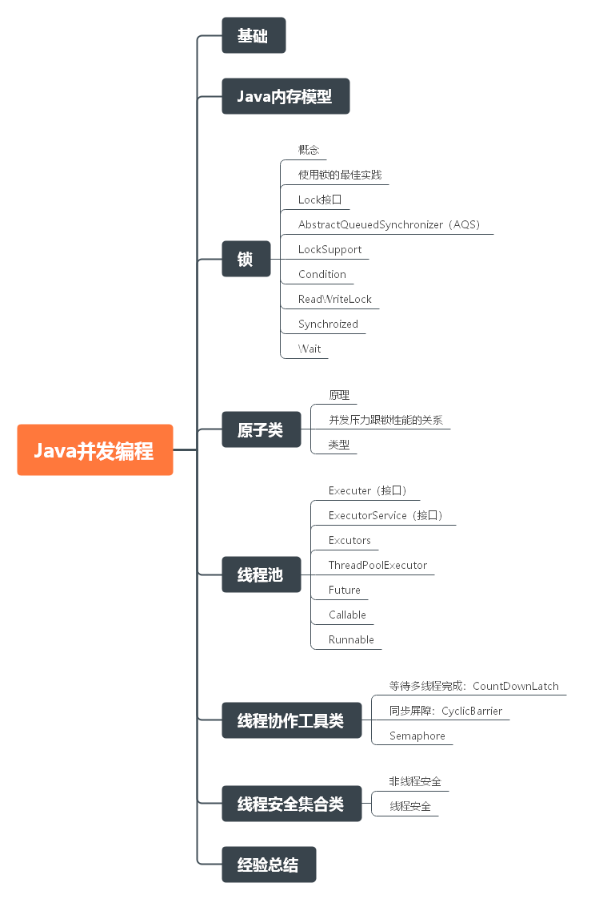

# 毕业总结

## 前言

其实回想起我第一次看见秦大哥这个训练营的时候，我一开始是拒绝的！因为我本来就对这些培训班不是很信任，而且你告诉我三个月进化成 P7 老子是不相信的！但是最后我还是报名了，为什么？第一，我对自己的技术渴望一个快速的成长，我感觉光靠自己难以实现；第二，谭超老师的算法课程给了我不错的印象；第三，老师的资历打动我了， Apache 顶级项目的 PMC，这是外面的培训机构很难见到的，除非是一些价格上万的课程。所以，我还是报名了，因为我觉得三个月不行，那我可以用更多的时间啊。

到了真正上课的时候，也确实如我所想的那样，想短时间内消化秦老师的所讲的知识点，简直就是不可能的，况且从学习到实践中间还需要很多路要走呢。所以一开始的时候，我就把课程的学习的时间周期拉长了很多，也许训练营结束了，但是我们学习还不能结束！而且秦老师后面把挑战作业的有效期延期到了一年后，我也更加坚定了我这个想法。

三个月以来，训练营给我最大的收获有三点：训练营热情的学习氛围；老师和助教的技术和职业经历给我们的指点；老师能带我们接触开源。

所以，总的来说训练营对我来说还是非常值得的！

## JVM

JVM 主要包括 JVM 和 字节码技术，这涉及到 java 语言的底层实现和运行环境。相对于其他 热门技术，JVM相关技术在工作中直接使用的机会不会很多，但是如果对于想进阶的程序员来说，这是一项必须掌握的技术，同时也是大厂面试中的重点。

重点掌握：

- 字节码：了解字节码基本指令；掌握一个以上有名字节码工具的使用，比如：CGlib、Javassist等
- JVM：了解各种 GC 的性质和不同场景下的选择；掌握 GC 日志的分析；掌握各个常用 JVM 调优工具

#### JVM基础

​	

#### JVM对象

#### 字节码

- 指令

- 线程栈和字节码的执行模型

  

#### GC

## NIO

#### NIO 介绍

#### Netty

#### API 网关设计

## 并发编程

下面是几个非常关键的知识点。

#### JMM

- 了解 JMM 模型
- 了解 happen-before 原则；了解重排序和顺序一致性；掌握 volatile 和 finnal 的语义。

#### 锁

- 锁的概念
  - 锁的类型：重入锁；公平锁；非公平锁；排它锁；共享锁。
  - 锁的优化：自旋锁；轻量级锁；重量级锁；偏向锁。
- Lock
  - 模板类：AbstractQueuedSynchronizer（AQS）。
  - LockSupport；Condition；ReadWriteLock；Synchroized；Wait。

#### 原子类

原子基本类型类；原子数组；原子引用类型；原子字段；LongAdder。

#### 线程协作工具

- 等待多线程完成：CountDownLatch
- 同步屏障：CyclicBarrier
- 信号量：Semaphore

#### 线程安全集合类

- 非线程安全：ArrayList；LinkedList；HashMap；LinkedHashMap等。
- 线程安全：CopyOnWriteArrayList；ConcurrentHashMap；ThreadLocal等。

#### 线程池

- Executer 接口。
- ExecutorService（接口）：Executer 的子接口。
- Excutors：ExecutorService 工厂类。
- ThreadPoolExecutor 的使用和各个参数的意义。
- Future、Callable、Runnable 的区别和用法。

## Spring 和 ORM

#### spring framework

#### spring boot

#### ORM

## MySQL 数据库和 SQL

#### MySQL

#### MySQL 集群

## 分库分表

## 分布式事务

## RPC 和 微服务

#### RPC

#### Dubbo 技术详解

## 分布式缓存

#### 缓存

#### Redis

#### 分布式缓存

## 分布式消息队列

#### 消息队列基础

#### Kafka

#### 其他MQ

# 分布式系统架构

