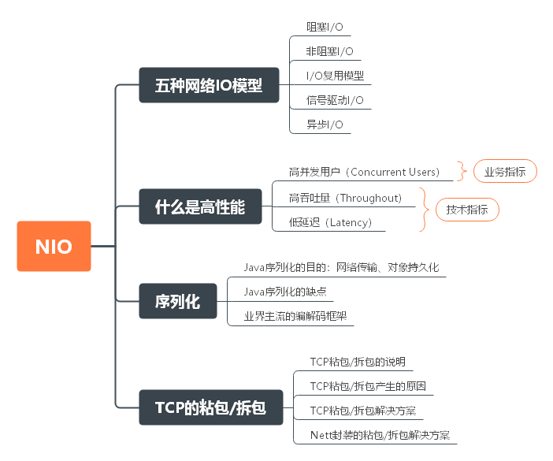
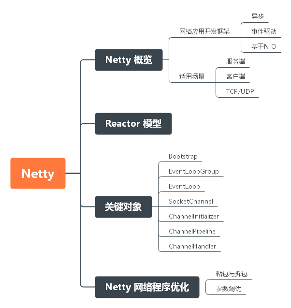

# 毕业总结

## 前言

其实回想起我第一次看见秦大哥这个训练营的时候，我一开始是拒绝的！因为我本来就对这些培训班就不是很信任，而且你告诉我三个月进化成 P7 老子是不相信的！但是最后我还是报名了，为什么？第一，我对自己的技术渴望一个快速的成长，我感觉光靠自己难以实现；第二，谭超老师的算法课程给了我不错的印象；第三，老师的资历打动我了， Apache 顶级项目的 PMC，这是外面的培训机构很难见到的，除非是一些价格上万的课程。所以，我还是报名了，因为我觉得三个月不行，那我可以用更多的时间啊。

到了真正上课的时候，也确实如我所想的那样，想短时间内消化秦老师的所讲的知识点，简直就是不可能的，况且从学习到实践中间还需要很多路要走呢。所以一开始的时候，我就把课程的学习的时间周期拉长了很多，也许训练营结束了，但是我们学习还不能结束！而且秦老师后面把挑战作业的有效期延期到了一年后，我也更加坚定了我这个想法。

三个月以来，训练营给我最大的收获有三点：训练营热情的学习氛围；老师和助教的技术和职业经历给我们指点；老师能带我们接触开源。所以，总的来说训练营对我来说还是非常值得的！

## JVM

JVM 主要包括 JVM 和 字节码技术，这涉及到 java 语言的底层实现和运行环境。字节码只要使用场景是开发，尤其涉及到 AOP 的实现上，而 JVM 知识则更多是用在运行环境的性能调优上，其中 GC 算法 和 GC 日志分析是重中之重。

#### JVM基础

​	

#### JVM对象

#### 字节码

- 指令

- 线程栈和字节码的执行模型

  

#### GC

## NIO

#### NIO 介绍

#### Netty

#### API 网关设计

## 并发编程

下面是几个非常关键的知识点。

#### JMM

#### 锁

#### 原子类

#### 线程协作工具

#### 线程安全集合类

#### 线程池

## Spring 和 ORM

## MySQL 数据库和 SQL

## 分库分表

## RPC 和 微服务

## 分布式缓存

## 分布式消息队列

