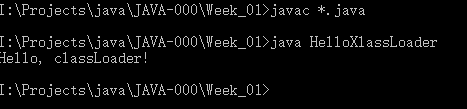
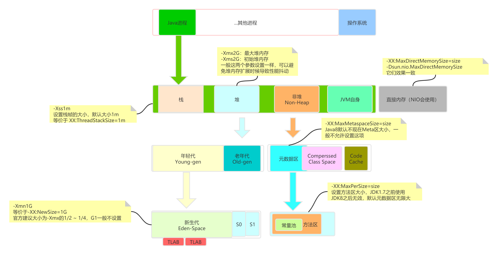
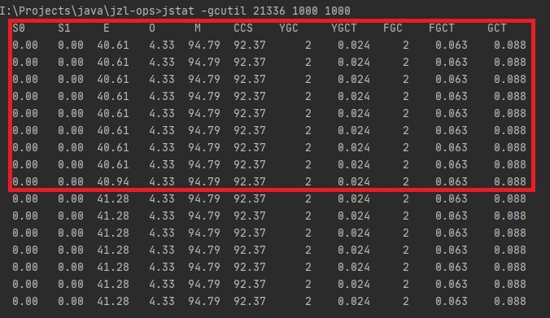

# 课后总结

## 第1周作业

### 1.自己写一个简单的Hello.java，里面需要涉及基本类型，四则运算，if和for，然后自己分析一下对应的字节码，有问题群里讨论

 **Java源码：**

```java
package demo.jvm0104;

import java.util.HashMap;
import java.util.Map;

public class Hello {
    private final Map<Integer, Integer> resCache = new HashMap<>();

    public int fibonacci(int n){
        if(n <= 1){
            return n;
        }
        if(!resCache.containsKey(n)){
            int f1 = 1;
            int f2 = 2;
            for(int i = 3; i <= n; i++){
                int res = f1 + f2;
                f1 = f2;
                f2 = res;
            }
            resCache.put(n,f2);
        }
        return resCache.get(n);
    }
}
```

**字节码分析**

```java
Classfile /I:/学习资料/Java学习路线/Java训练营/Week01-Java进阶训练营-JVM进阶/总结/javabytecode/demo/jvm0104/Hello.class
  Last modified 2020-10-20; size 887 bytes
  //魔数：确定当前文件是否为java虚拟机锁接受的Class文件
  MD5 checksum f09a9084ab198225340ecf205382ac31
  Compiled from "Hello.java"
public class demo.jvm0104.Hello
  //次版本号
  minor version: 0
  //主版本号 （Java主版本号是从45开始，JDK1.1之后每个大版本发布主版本号加1）
  major version: 52
  //访问标记
  flags: ACC_PUBLIC, ACC_SUPER
  //常量池
Constant pool:
   #1 = Methodref          #12.#26        // java/lang/Object."<init>":()V
   #2 = Class              #27            // java/util/HashMap
   #3 = Methodref          #2.#26         // java/util/HashMap."<init>":()V
   #4 = Fieldref           #11.#28        // demo/jvm0104/Hello.resCache:Ljava/util/Map;
   #5 = Methodref          #9.#29         // java/lang/Integer.valueOf:(I)Ljava/lang/Integer;
   #6 = InterfaceMethodref #30.#31        // java/util/Map.containsKey:(Ljava/lang/Object;)Z
   #7 = InterfaceMethodref #30.#32        // java/util/Map.put:(Ljava/lang/Object;Ljava/lang/Object;)Ljava/lang/Object;
   #8 = InterfaceMethodref #30.#33        // java/util/Map.get:(Ljava/lang/Object;)Ljava/lang/Object;
   #9 = Class              #34            // java/lang/Integer
  #10 = Methodref          #9.#35         // java/lang/Integer.intValue:()I
  #11 = Class              #36            // demo/jvm0104/Hello
  #12 = Class              #37            // java/lang/Object
  #13 = Utf8               resCache
  #14 = Utf8               Ljava/util/Map;
  #15 = Utf8               Signature
  #16 = Utf8               Ljava/util/Map<Ljava/lang/Integer;Ljava/lang/Integer;>;
  #17 = Utf8               <init>
  #18 = Utf8               ()V
  #19 = Utf8               Code
  #20 = Utf8               LineNumberTable
  #21 = Utf8               fibonacci
  #22 = Utf8               (I)I
  #23 = Utf8               StackMapTable
  #24 = Utf8               SourceFile
  #25 = Utf8               Hello.java
  #26 = NameAndType        #17:#18        // "<init>":()V
  #27 = Utf8               java/util/HashMap
  #28 = NameAndType        #13:#14        // resCache:Ljava/util/Map;
  #29 = NameAndType        #38:#39        // valueOf:(I)Ljava/lang/Integer;
  #30 = Class              #40            // java/util/Map
  #31 = NameAndType        #41:#42        // containsKey:(Ljava/lang/Object;)Z
  #32 = NameAndType        #43:#44        // put:(Ljava/lang/Object;Ljava/lang/Object;)Ljava/lang/Object;
  #33 = NameAndType        #45:#46        // get:(Ljava/lang/Object;)Ljava/lang/Object;
  #34 = Utf8               java/lang/Integer
  #35 = NameAndType        #47:#48        // intValue:()I
  #36 = Utf8               demo/jvm0104/Hello
  #37 = Utf8               java/lang/Object
  #38 = Utf8               valueOf
  #39 = Utf8               (I)Ljava/lang/Integer;
  #40 = Utf8               java/util/Map
  #41 = Utf8               containsKey
  #42 = Utf8               (Ljava/lang/Object;)Z
  #43 = Utf8               put
  #44 = Utf8               (Ljava/lang/Object;Ljava/lang/Object;)Ljava/lang/Object;
  #45 = Utf8               get
  #46 = Utf8               (Ljava/lang/Object;)Ljava/lang/Object;
  #47 = Utf8               intValue
  #48 = Utf8               ()I
{
  //构造方法
  public demo.jvm0104.Hello();
    descriptor: ()V
    //访问标记
    flags: ACC_PUBLIC
    Code:
      //计数栈最大深度3
      //局部变量表插槽数1，用来存储this
      //参数个数1，这里的一个参数是this
      stack=3, locals=1, args_size=1
        /**
         * 0 -> 1: super()
         */
        //装载0号局部变量的值，即是this
         0: aload_0
         //调用Objec.<init>方法
         1: invokespecial #1                  // Method java/lang/Object."<init>":()V
         /**
          * 4 -> 12: Map<Integer, Integer> resCache = new HashMap<>();
          */
         //装载0号局部变量的值，即是this
         4: aload_0
         //创建一个HashMap对象
         5: new           #2                  // class java/util/HashMap
         //复制新创建的HashMap对象的引用，并且压入栈顶
         8: dup
         //调用HashMap对象构造方法进行初始化
         9: invokespecial #3                  // Method java/util/HashMap."<init>":()V
         //对实例域this.resCache进行赋值
        12: putfield      #4                  // Field resCache:Ljava/util/Map;
        15: return
      LineNumberTable:
        line 6: 0
        line 7: 4

  public int fibonacci(int);
    //方法描述 参数 int 返回 int
    descriptor: (I)I
    //访问标记
    flags: ACC_PUBLIC
    Code:
      //计数栈最大深度3
      //局部变量表插槽数6
      //参数个数2，一个是this，占用0号插槽；一个是方法入参int，占用1号插槽
      stack=3, locals=6, args_size=2
      /**
       * 0 -> 2: if(n <= 1)
       */
         0: iload_1                           //加载1号局部变量的值，即是类型int的入参
         1: iconst_1                          //加载常量1
         2: if_icmpgt     7                   //类型int入参 > 1 ? 跳到7号指令执行 ：往下继续执行5号指令
         /**
          * 5 -> 6: return n;
          */
         5: iload_1                           //加载1号局部变量的值，即是入参
         6: ireturn                           //直接返回栈顶整数，即是刚刚加载的入参
         /**
          * 7 -> 20: if(!resCache.containsKey(n))
          */
         7: aload_0                           //加载this引用
         8: getfield      #4                  // Field resCache:Ljava/util/Map; 获取实例域引用，常量池中 #4 即是this.resCache
         11: iload_1                          //加载1号局部变量的值
        12: invokestatic  #5                  // Method java/lang/Integer.valueOf:(I)Ljava/lang/Integer; //装箱：调用静态方法Integer.valueOf(int)
        15: invokeinterface #6,  2            // InterfaceMethod java/util/Map.containsKey:(Ljava/lang/Object;)Z  //调用接口方法：#6 即是Map.containsKey       
        20: ifne          70                  //判断栈顶返回值 != 0 ? 直接跳转到70号指令执行 ： 继续往下执行23号指令 //即是判断Map.containsKey是否为真
        /**
         * 23 -> 24: int f1 = 1;
         */
        23: iconst_1                          //加载常量1
        24: istore_2                          //常量1出栈，存储到本地变量表2号插槽，类型int
        /**
         * 25 -> 26: int f2 = 2;
         */
        25: iconst_2                          //加载常量2
        26: istore_3                          //常量2出栈，存储到本地变量表3号插槽，类型int
        /**
         * 27 -> 33：for循环控制 for(int i = 3; i <= n; i++)
         */
        27: iconst_3                         //加载常量3
        28: istore        4                  //常量3出栈，存储到本地变量表4号插槽，类型int，for循环中的变量i
        30: iload         4                  //加载本地变量表4号变量的值到栈顶
        32: iload_1                          //加载本地变量表1号变量的值到栈顶，即方法入参
        33: if_icmpgt     52                 //比较栈顶两个数，i > n ? 跳转到52号指令执行 ： 继续往下执行
        /**
         * 36 -> 39：int res = f1 + f2;
         */
        36: iload_2                          //加载局部变量表2号变量的值
        37: iload_3                          //加载局部变量表3号变量的值
        38: iadd                             //栈顶两个整数加法运算
        39: istore        5                  //返回值出栈，并且存储到局部变量表5号插槽
        /**
         * 41 -> 42: f1 = f2;
         */
        41: iload_3                          //加载局部变量表3号变量的值
        42: istore_2                         //把3号变量的值赋值给2号变量
        /**
         * 43 -> 45: f2 = res;
         */
        43: iload         5                  //加载5号变量的值，压入栈顶
        45: istore_3                         //栈顶的5号变量的值出栈，赋值给3号变量
        /**
         * i++ 循环
         */
        46: iinc          4, 1               //4号变量自增1
        49: goto          30                 //跳转到指令40执行
        /**
         * 52 -> 69: resCache.put(n,f2);
         */
        52: aload_0                          //加载this
        53: getfield      #4                 // Field resCache:Ljava/util/Map; //获取实例域this.resCache
        56: iload_1                          //加载1号变量的值，即入参
        57: invokestatic  #5                 // Method java/lang/Integer.valueOf:(I)Ljava/lang/Integer; //装箱：调用静态方法Integer.valueOf()
        60: iload_3                          //加载3号变量的值
        61: invokestatic  #5                 // Method java/lang/Integer.valueOf:(I)Ljava/lang/Integer; //装箱：调用Integer.valueOf()
        64: invokeinterface #7,  3           // InterfaceMethod java/util/Map.put:(Ljava/lang/Object;Ljava/lang/Object;)Ljava/lang/Object; ////调用接口方法Map.put
        69: pop                              //返回值出栈
        /**
         * 70 -> 89: return resCache.get(n);
         */
        70: aload_0                          //加载this应用
        71: getfield      #4                 // Field resCache:Ljava/util/Map;//获取实例域
        74: iload_1                          //加载实例域引用到栈顶
        75: invokestatic  #5                 // Method java/lang/Integer.valueOf:(I)Ljava/lang/Integer; //装箱
        78: invokeinterface #8,  2           // InterfaceMethod java/util/Map.get:(Ljava/lang/Object;)Ljava/lang/Object;//调用实例resCache的接口方法Map.get
        83: checkcast     #9                 // class java/lang/Integer //方法返回值类型转换 object -> Integer
        86: invokevirtual #10                // Method java/lang/Integer.intValue:()I //拆箱：用方法intValue()，返回值存入栈顶
        89: ireturn                          //返回栈顶的的值
      LineNumberTable:
        line 10: 0
        line 11: 5
        line 13: 7
        line 14: 23
        line 15: 25
        line 16: 27
        line 17: 36
        line 18: 41
        line 19: 43
        line 16: 46
        line 21: 52
        line 23: 70
      StackMapTable: number_of_entries = 4
        frame_type = 7 /* same */
        frame_type = 254 /* append */
          offset_delta = 22
          locals = [ int, int, int ]
        frame_type = 250 /* chop */
          offset_delta = 21
        frame_type = 249 /* chop */
          offset_delta = 17
}
SourceFile: "Hello.java"
```

### 2.自定义一个ClassLoader，加载一个Hello.xlass文件，执行hello方法，此文件内容是一个Hello.class文件所有字节（x=255-x）处理后的文件。文件群里面提供。

> 1.自定义ClassLoader文件是当前目录下的HelloXlassLoader.class
>
> 2.运行结果：

### 3.画一张图，展示Xmx,Xms,Xmn,Meta,DirectMemory,Xss这些内存参数的关系。



### 4.检查一下自己维护的业务系统的JVM参数配置，用jstat和jstack、jmap查看一下详情，并且独立分析一下大概的情况，思考有没有不合理的地方，如何改进。

由于没有生产环境进行调试，下面是在idel上运行了一个web demo进行调试

**采用默认启动参数**

- 通过 jcmd pid VM.flags 查看JVM启动参数

  ```
  -XX:CICompilerCount=4 -XX:InitialHeapSize=268435456 -XX:MaxHeapSize=4276092928 -XX:MaxNewSize=1425014784 -XX:MinHeapDeltaBytes=524288 -XX:NewSize=89128960 -XX:OldSize=179306496 -XX:+UseCompressedClassPointers -XX:+UseCompressedOops
  -XX:+UseFastUnorderedTimeStamps -XX:-UseLargePagesIndividualAllocation -XX:+UseParallelGC
  分析：
  -XX:InitialHeapSize=268435456：等同于-Xms=256m，堆初始化容量 
  -XX:MaxHeapSize=4276092928：等同于-Xmx=4g，堆的最大容量
  -XX:MaxHeapSize=4276092928：新生代最大可分配内存1356m
  -XX:NewSize=89128960：等同-Xmn=85m
  -XX:OldSize=179306496：老年代初始容量171m
  -XX:+UseParallelGC：使用并行垃圾回收器
  
  ```

- 通过jmap -heap pid查看堆内存分配

  

  从上面可以看出在默认启动的情况下，有些注意的地方：

  - Heap Configuration中新生代初始只有85m和最大值1359m差很远，但是下面Heap Usage中显示是175m，是不是应该进行过扩容。
  - Heap Configuration中显示OldSize=171m，但是下面Heap Usage显示只有113m，有些疑惑。
  - 所以在使用默认启动的情况下是不是多了一些不可控的因素

- 使用jstat -gcutil pid 1000 1000动态查看内存使用情况

  

  上半部分是没有使用工具压测的情况：

  - 两个交换区使用率都是0
  - 新生代使用率是59.14%
  - 老年代使用率是8.89%
  - 元数据区使用率是94.70%
  - 新生代发生Yang GC的次数是6，总消耗时间是37ms
  - FullGC的次数是2，总时间是53ms
  - 总的GC时间90ms

  下半部分是使用postman进行持续访问后的数据

  - 新生代使用率由50%上升到99.87%并且接下来发生了异常YGC，用时11ms
  - 发生YGC后交换区S1使用率变成了98.51%
  - old区几乎没发生改变

  下面是我进行继续压测后，通过jmap查看heap新生代发生了扩容

  

  新生代有原来的175m变成295m，而老生代没有发生变化

**采用固定参数启动**

- 启动参数

  

- jmap产看Heap情况

  

  - Heap Configuration中的数据和设置的启动参数一致
  - Heap Usage中新生代初始容量不是512m，因为上面参数只设置了-Xmn新生代最大容量
  - 两个交换区和MaxNewSize差不多是8:1:1的关系
  - 老生代容量Configuration和Usage中是一致的，其容量等于Xmx 减去Xmn
  - 固定参数JVM的内存可控度比默认的更加高

- jstat 查看内存使用情况

  

  - 跟默认启动的比新生代和老生代使用率都变低
  - 启动后只发生了2次YGC，总的时间是24ms
  - 发生了两次FullGC，总的时间是63ms
  - 总的GC时间是88ms
  - 上半部分是启动后的情况，下半部分是使用Postman进行压测的情况，可以发现相对上面默认参数的情况，新生代使用率上升的趋势下降了很多。上升数据很长所以只截了一部分。

  ### 5.本机使用G1 GC启动一个程序，仿照课上案例分析一下JVM情况

  - 启动参数设置

    

  - jmap命令查看内存使用情况

    

  - jstat动态查看内存使用情况

    

  - 和Parallel GC不一样地方：

    - 交换区s1启动的时候就是使用率100%
    - 老年区完全没被使用
    - 上半部分是没有压测的情况，下半部分是压测的情况，发现开始新生代使用率上升的趋势比Parallel GC要快一点，暂时还不明白其中原因。