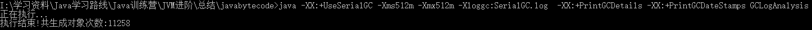
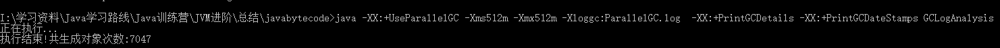
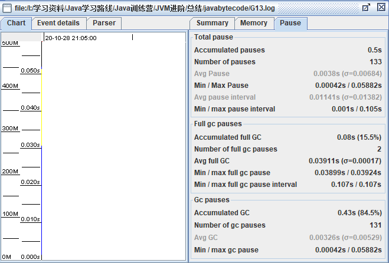

# 使用 GCLogAnalysis.java 自己演练一遍串行 / 并行 /CMS/G1 的案例

## 使用串行GC

```
java -XX:+UseSerialGC -Xms512m -Xmx512m -Xloggc:SerialGC.log  -XX:+PrintGCDetails -XX:+PrintGCDateStamps GCLogAnalysis
```

#### 运行结果



一共生成了11258个对象。

#### 日志总体分析


#### 日志详细分析

##### Minor GC

```powershell
2020-10-27T17:37:55.350+0800: 0.465: [GC (Allocation Failure) 2020-10-27T17:37:55.350+0800: 0.465: [DefNew: 157247K->17471K(157248K), 0.0184998 secs] 447923K->351608K(506816K), 0.0186183 secs] [Times: user=0.01 sys=0.00, real=0.02 secs] 
```

- 2020-10-27T17:37:55.350+0800: 0.465:
  - 2020-10-27T17:37:55.350：表示GC发生的时间
  - +0800：表示这是东八时区
  - 0.465：当前GC发生距离JVM启动的时间，单位是秒，表示这次GC是在JVM启动0.465秒后发生的。
- GC (Allocation Failure)
  - GC：表示这是一次Minor GC，也就是年轻代区发生的GC。
  - Allocation Failure：GC发生的原因，这里是内存申请失败，触发了这一次Minor GC
-  [DefNew: 157247K->17471K(157248K), 0.0184998 secs]
  - DefNew：表示垃圾收集器的名称，说明年轻代使用单线程、标记-复制算法、STW垃圾收集器。
  - (157248K)：表示年轻代总容量
  - 157247K：表示GC前年轻代的使用量，157247 / 157248 = 99%，几乎已经全部用完了。
  - 17471K：表示GC后年轻代的使用量，**回收后内存使用率下降到17471 /  157248 = 11%。年轻代回收效果十分的明显。**
  - 0.0184998 secs：这次年轻代GC耗时18毫秒左右。
- 447923K->351608K(506816K), 0.0186183 secs]
  - (506816K)：堆内存的总容量
  - 447923K：GC前堆内存的使用量，447923 / 506816 = 88%
  - 351608K： **GC后堆内存的使用量，351608 / 506816  = 69%，从这里可以看出虽然前面年轻代区回收效果很明显，但是总的堆内存回收效果却并不是十分的明显，说明有不少的对象晋升到了Old区 。**
- [Times: user=0.01 sys=0.00, real=0.02 secs] ：此次GC所持续的时间，分三部分来衡量。
  - user=0.01：表示所有GC线程消耗的总时间，这里是10毫秒。
  - sys=0.00：表示系统调用和系统等待事件消耗的时间，这里是0秒。由于Serial GC是单线程的GC，从这里看出效率还是非常的高，几乎没有系统等待时间。
  -  real=0.02：表示应用暂停的时间，表示这次GC应用暂停了20毫秒

##### Major GC

```
2020-10-27T17:37:55.386+0800: 0.502: [GC (Allocation Failure) 2020-10-27T17:37:55.386+0800: 0.502: [DefNew: 157247K->157247K(157248K), 0.0000225 secs]2020-10-27T17:37:55.386+0800: 0.502: [Tenured: 334137K->267976K(349568K), 0.0356503 secs] 491384K->267976K(506816K), [Metaspace: 2725K->2725K(1056768K)], 0.0357939 secs] [Times: user=0.05 sys=0.00, real=0.04 secs] 
```

由于大部分格式和语义和上面一致，因此这里只列出不同的地方和一些值得注意的地方。

- [DefNew: 157247K->157247K(157248K), 0.0000225 secs]：语义和上面的一样，但是这里年轻代GC前后的内存使用里都是157247K，耗时0.0000225秒，也就是Major GC没有处理年轻代。
- [Tenured: 334137K->267976K(349568K), 0.0356503 secs]
  - Tenured：Old区垃圾收集器名称，表示使用的是单线程的STW收集器、使用的算法是标记-清除-整理（mark-sweep-compact）。
  - (349568K)：Old区总容量是349568K。
  - **334137K：GC前Old区的使用量，使用率是334137 / 349568 = 96%，说明Old区的使用率非常的高了。**
  - **267976K：GC后Old区的使用量，使用率下降到267976 / 349568 = 77%，下降了20%不到，说明这样下去Old区很可能会爆满。**
  - **0.0356503 secs：耗时356毫秒，这次GC时间相当的长。**
- 491384K->267976K(506816K)：堆内存总容量是506816K，总的使用量由491384K下将到267976K。
- [Metaspace: 2725K->2725K(1056768K)], 0.0357939 secs]：元数据区，总容量是1056768K，GC前后都是2725K，并没有发生变化，说明这次GC主要处理Old区。
- [Times: user=0.05 sys=0.00, real=0.04 secs] ：GC线程耗时50毫秒，系统等待0秒，总的应用暂停时间40毫秒。

##### Full GC

```
2020-10-27T17:37:55.859+0800: 0.974: [Full GC (Allocation Failure) 2020-10-27T17:37:55.859+0800: 0.974: [Tenured: 349510K->349563K(349568K), 0.0478513 secs] 506157K->365242K(506816K), [Metaspace: 2725K->2725K(1056768K)], 0.0479489 secs] [Times: user=0.06 sys=0.00, real=0.05 secs] 
```

- 2020-10-27T17:37:55.859+0800: 0.974: 表示GC发生时间，语义和上面Minor GC一样。
- [Full GC (Allocation Failure)
  - FUll GC：表示这是一次完全GC
  - Allocation Failure： 内存申请失败
- [Tenured: 349510K->349563K(349568K), 0.0478513 secs] ：Old区内存总容量是349568K，**而GC前后的内存变化是 349510K->349563K，也就是这次GC效果几乎为0**，耗时478毫秒。
- **从上面日志可以看出这次Full GC之后，系统已经开始连续发生Full GC，而且由于是串行GC，所有应用可以说几乎完全停掉了，也可以说是崩了**。


## 使用并行GC

```
javabytecode>java -XX:+UseParallelGC -Xms512m -Xmx512m -Xloggc:ParallelGC.log  -XX:+PrintGCDetails -XX:+PrintGCDateStamps GCLogAnalysis
```

### 运行结果



### 日志总体分析


### 详细日志分析

##### Minor GC

```
2020-10-27T22:26:45.497+0800: 0.188: [GC (Allocation Failure) [PSYoungGen: 131584K->21487K(153088K)] 131584K->45876K(502784K), 0.0081747 secs] [Times: user=0.05 sys=0.08, real=0.35 secs] 
```

- 2020-10-27T22:26:45.497+0800: 0.188: ：GC的起始时间
- GC (Allocation Failure)  ： Minor GC，原因是申请内存失败
- [PSYoungGen: 131584K->21487K(153088K)]
  - PSYoungGen：垃圾收集器的名称，表示使用的是并行的标记-复制，STW（全线暂停）的垃圾收集器
  - (153088K)：新生代内存总量153088K
  - GC前新生代内存使用量131584K，使用率是131584 / 153088 = 86%。
  - GC后新生代内存使用量21487K，使用率下降到 21487 / 153088 = 14%。

- [Times: user=0.05 sys=0.08, real=0.35 secs] ：
  - user：表示GC消耗的总时间是0.05秒
  - sys：表示操作系统调用和系统事件等待所化的时间是0.08秒
  - real：约等于 user + sys / GC线程数，但是这里第一次GCreal时间为什么会这么高？0.35秒！是GC在开始的时候要初始化一些东西么？


##### Full GC

```
2020-10-27T22:26:46.070+0800: 0.762: [Full GC (Ergonomics) [PSYoungGen: 35548K->0K(116736K)] [ParOldGen: 294313K->232431K(349696K)] 329861K->232431K(466432K), [Metaspace: 2725K->2725K(1056768K)], 0.0326121 secs] [Times: user=0.25 sys=0.00, real=0.03 secs] 
```

- [Full GC (Ergonomics) ：
  - Full GC：表示这是一次完全GC，同时清理年轻代和老年代。
  - Ergonomics：触发GC的原因，表示JVM内部环境认为此时可以进行一次垃圾
    收集
- [PSYoungGen: 35548K->0K(116736K)]：
  - PSYoungGen：垃圾收集器的名称，表示使用的是并行的标记-复制（mark-copy），STW（全线暂停）的垃圾收集器。
  - (116736K)：新生代内存总量116736K
  - GC前新生代内存使用量35548K，使用率是35548 / 116736= 30%。
  - GC后新生代内存使用量21487K，使用率下降到 0/ 116736= 0%。
- [ParOldGen: 294313K->232431K(349696K)]：
  - ParOldGen：并行的STW垃圾回收器，使用的算法是标记-清除-整理（mark-sweep-compact）
  - (349696K)：Old区总容量349696K
  - 294313K：GC前Old区使用量294313K，使用率是294313 / 349696 = 84%
  - 232431K：GC后Old区使用量232431K，使用率下降到232431 / 349696 = 66%，下降了18%。
- 329861K->232431K(466432K)：
  - (466432K)：堆内存总容量466432K。
  - 329861K：堆内存GC前的使用量329861K，使用率是329861 / 466432 = 71%。
  - 232431K：堆内存GC后使用量232431K，使用率下降到232431 / 466432  = 50%，下降了21%。
- [Metaspace: 2725K->2725K(1056768K)], 0.0326121 secs] ：
  - Metaspace：元数据区。
  - 1056768K：元数据区总容量1056768K。
  - 2725K->2725K：元数据区GC前后都没有变化，都是2725K
- [Times: user=0.25 sys=0.00, real=0.03 secs] 
  - user=0.25：所有GC线程全部耗时0.25秒。
  - sys=0.00：系统调用和系统事件等待时间几乎为0.
  - real=0.03：应用真正暂停的时间，约等于 （user + sys）/ GC线程数，我这里是4核8线程，所以0.25 / 8 约等于0.03，这里还是满接近的。

## 使用CMS GC

```
java -XX:+UseConcMarkSweepGC -Xms512m -Xmx512m -Xloggc:CMS.log  -XX:+PrintGCDetails -XX:+PrintGCDateStamps GCLogAnalysis
```

### 运行结果


### 日志总体分析


### 日志详细分析

##### Minor GC

```
2020-10-28T18:24:23.477+0800: 0.684: [GC (Allocation Failure) 2020-10-28T18:24:23.477+0800: 0.684: [ParNew: 157247K->17469K(157248K), 0.0220519 secs] 321336K->227134K(506816K), 0.0221568 secs] [Times: user=0.13 sys=0.00, real=0.02 secs] 
```

- 2020-10-28T18:24:23.477+0800: 0.684：和前面GC的一样，表示GC发生的时间是东八时区2020-10-28 18:24:22.989，距离JVM启动197毫秒。

- GC (Allocation Failure) ：这是一次Minor GC，GC的原因是申请内存失败。

-  [ParNew: 157247K->17469K(157248K), 0.0220519 secs]

  - ParNew：这是多线程的STW垃圾收集器，使用算法是标记-复制（mark-copy）。
  - (157248K)：年轻代总容量是157248K。
  - 157247K：GC前年轻代的使用量是139776，使用率是157247/ 157248 = 99%
  - 17469K：GC后的年轻代使用量是17472K，使用率下降到 17469 / 157248  = 11%
  - 0.0220519 secs：整个年轻代回收过程耗时22毫秒

- 321336K->227134K(506816K), 0.0221568 secs] 

  - (506816K)：堆内存总容量506816K
  - 321336K：堆内存GC前的使用量，使用率是321336 / 506816 = 63%
  - 227134K：堆内存GC后的使用量，使用率下降到227134 / 506816 = 45%

- Times: user=0.13 sys=0.00, real=0.02 secs]：

  - user=0.13 ：所有GC线程耗时0.13秒。
  - sys=0.00：表示系统调用和时间等待的时间机几乎为0。

  - real=0.02 secs：应用暂停时间，约等于（user + sys）/ GC线程数。上面日志头部打印-XX:MaxTenuringThreshold=6，说明当前用的CMS GC线程数是6，因此这个（0.13 + 0）/ 6确实约等于0.02

##### Major GC

  一次CMS日志很长，这里拆分成几个部分来讲解

- 初始标记

  ```
  2020-10-28T18:24:23.499+0800: 0.706: [GC (CMS Initial Mark) [1 CMS-initial-mark: 209664K(349568K)] 227769K(506816K), 0.0002057 secs] [Times: user=0.00 sys=0.00, real=0.00 secs] 
  ```

  - GC (CMS Initial Mark) : 表示这是一次CMS GC，阶段是初始标记阶段，主要是标记所有的根对象、根对象的直接应用、所有年轻代中存活对象对老年区对象的引用。
  - [1 CMS-initial-mark: 209664K(349568K)] 227769K(506816K), 0.0002057 secs]
    - (349568K)：表示老年代总容量是349568K
    - 209664K：表示当前老年代的使用量是209664K，使用率是209664 / 349568 = 60%，表示在老年代使用率达到60时候，触发了一次CMS GC。
    - 0.0002057 secs：整个阶段耗时0.0002057秒，**这个阶段是需要STW的**，但是非常短。

- 并发标记

  ```
  2020-10-28T18:24:23.500+0800: 0.707: [CMS-concurrent-mark-start]
  2020-10-28T18:24:23.501+0800: 0.708: [CMS-concurrent-mark: 0.001/0.001 secs] [Times: user=0.00 sys=0.00, real=0.00 secs] 
  ```

  这个阶段是从上一个节点标记的根对象开始，遍历整个老年代，标记所有的存活对象。这是和用户线程并发进行的，不需要STW。

  - [CMS-concurrent-mark-start]：并发标记开始
  - [CMS-concurrent-mark: 0.001/0.001 secs]：并发标记结束

- 并发预处理

  ```
  2020-10-28T18:24:23.501+0800: 0.708: [CMS-concurrent-preclean-start]
  2020-10-28T18:24:23.501+0800: 0.708: [CMS-concurrent-preclean: 0.000/0.000 secs] [Times: user=0.00 sys=0.00, real=0.00 secs] 
  2020-10-28T18:24:23.501+0800: 0.708: [CMS-concurrent-abortable-preclean-start]
  //这里发生了几次Minor GC
  2020-10-28T18:24:23.517+0800: 0.724: [GC (Allocation Failure) 2020-10-
  28T18:24:23.517+0800: 0.724: [ParNew: 157245K->17470K(157248K), 0.0202377 secs] 366910K->269020K(506816K), 0.0203354 secs] [Times: user=0.11 sys=0.02, real=0.02 secs] 
  //..
  2020-10-28T18:24:23.615+0800: 0.822: [CMS-concurrent-abortable-preclean: 0.002/0.114 secs] [Times: user=0.42 sys=0.03, real=0.11 secs] 
  ```

  此阶段同样是与应用线程并发执行的，不需要停止应用线程。因为前一阶段【并发标记】与程序并发运行，可能有一些引用关系已经发生了改变。如果在并发标记过程中引用关系发生了变化，JVM 会通过“Card（卡片）”的方式将发生了改变的区域标记为“脏”区，这就是所谓的卡片标记（Card Marking）。

- 最终标记

  ```
  2020-10-28T18:24:23.615+0800: 0.822: [GC (CMS Final Remark) [YG occupancy: 20531 K (157248 K)]2020-10-28T18:24:23.615+0800: 0.822: [Rescan (parallel) , 0.0002445 secs]2020-10-28T18:24:23.615+0800: 0.823: [weak refs processing, 0.0000203 secs]2020-10-28T18:24:23.615+0800: 0.823: [class unloading, 0.0002085 secs]2020-10-28T18:24:23.616+0800: 0.823: [scrub symbol table, 0.0003695 secs]2020-10-28T18:24:23.616+0800: 0.823: [scrub string table, 0.0001071 secs][1 CMS-remark: 339056K(349568K)] 359588K(506816K), 0.0010788 secs] [Times: user=0.02 sys=0.00, real=0.00 secs] 
  ```

  - [GC (CMS Final Remark)：最终标记阶段，**是此次GC 事件中的第二次（也是最后一次）STW 停顿**。本阶段的目标是完成老年代中所有存活对象的标记. 因为之前的预清理阶段是并发执行的，有可能GC 线程跟不上应用程序的修改速度。所以需要一次STW 暂停来处理各种复杂的情况。通常CMS 会尝试在年轻代尽可能空的情况下执行FinalRemark 阶段，以免连续触发多次STW 事件。
  - [YG occupancy: 20531 K (157248 K)]：
    - (157248 K)：当前年轻代的总容量是157248 K
    - 20531 K：当前年轻代使用量是20531 K，使用率是20531 / 157248 = 13%，通常重新标记阶段要运行在年轻代尽量干净的时候。
  - [Rescan (parallel) , 0.0002445 secs]：整个ReMark阶段的耗时总计是0.0002445秒，parallel表示是并发执行的。
  - [weak refs processing, 0.0000203 secs]：弱引用处理，耗时0.0000203 secs。
  - [scrub symbol table, 0.0003695 secs]：卸载无用的类，耗时0.0003695 secs。
  - [scrub symbol table, 0.0003695 secs]： 清理包含类级元数据和内部化字符串的符号，耗时  0.0003695 secs
  - [scrub string table, 0.0001071 secs]：清理字符串表，耗时0.0001071 secs。
  - 上面从Rescan (parallel)到scrub string table，其前面的执行时间都是距离JVM启动0.823秒，说明这些阶段都是并发执行的。
  - [1 CMS-remark: 339056K(349568K)] 359588K(506816K), 0.0010788 secs] ：
    - (349568K)：当前阶段标记后，Old区的总容量是349568K。
    - 339056K：当前阶段标记后，Old区的使用量是339056K，使用率是339056 / 349568 = 97%。
    - (506816K)：当前阶段标记后，堆的总容量是506816K。
    - 359588K：当前阶段标记后，堆的使用量是359588K，使用率是359588 / 506816 = 71%
    - 0.0010788 secs：耗时0.0010788 secs。

- 并发清除

  ```
  2020-10-28T18:24:23.616+0800: 0.823: [CMS-concurrent-sweep-start]
  2020-10-28T18:24:23.617+0800: 0.824: [CMS-concurrent-sweep: 0.001/0.001 secs] [Times: user=0.00 sys=0.00, real=0.00 secs] 
  ```

  此阶段与应用程序并发执行，不需要STW 停顿。JVM 在此阶段删除不再使用的对象，并回收他们占用的内存空间。

- 并发重置

  ```
  2020-10-28T18:24:23.617+0800: 0.824: [CMS-concurrent-reset-start]
  2020-10-28T18:24:23.617+0800: 0.825: [CMS-concurrent-reset: 0.001/0.001 secs] [Times: user=0.00 sys=0.00, real=0.00 secs]
  ```

  此阶段与应用程序并发执行，重置CMS 算法相关的内部数据，为下一次GC 循环做准备。

## 使用G1 GC

```
java -XX:+UseG1GC -Xms512m -Xmx512m -Xloggc:G13.log  -XX:+PrintGC -XX:+PrintGCDateStamps GCLogAnalysis
```

### 运行结果


### 日志总体分析



### 日志详细分析

##### 新生代收集

```
2020-10-28T21:04:56.514+0800: 0.153: [GC pause (G1 Evacuation Pause) (young) 34M->14M(512M), 0.0034474 secs]
```

- 2020-10-28T21:04:56.514+0800: 0.153:：表示GC发生的时间，和上面其他GC一样。
- [GC pause (G1 Evacuation Pause) ：将活的对象拷贝到另外一个区域。
- (young)：年轻代的GC收集
- 34M->14M(512M)
  - (512M)：堆总容量，512m
  - 34M：堆内存GC前的使用量34m，使用率 34 / 512 = 7%
  - 14M：堆内存GC后的使用量14m，使用率14 / 512 =  3%，可以发现G1在年轻代内存使用率还是很低的时候，就开始回收了。
  - 0.0034474 secs：耗时0.0034474秒。

##### 并发垃圾收集

```
2020-10-28T21:04:56.707+0800: 0.347: [GC pause (G1 Humongous Allocation) (young) (initial-mark) 270M->219M(512M), 0.0052570 secs]
2020-10-28T21:04:56.713+0800: 0.352: [GC concurrent-root-region-scan-start]
2020-10-28T21:04:56.713+0800: 0.352: [GC concurrent-root-region-scan-end, 0.0002380 secs]
2020-10-28T21:04:56.713+0800: 0.352: [GC concurrent-mark-start]
2020-10-28T21:04:56.714+0800: 0.354: [GC concurrent-mark-end, 0.0013163 secs]
2020-10-28T21:04:56.714+0800: 0.354: [GC remark, 0.0015404 secs]
2020-10-28T21:04:56.716+0800: 0.356: [GC cleanup 229M->229M(512M), 0.0010242 secs]
//混合模收集
2020-10-28T21:04:56.762+0800: 0.401: [GC pause (G1 Evacuation Pause) (mixed) 312M->289M(512M), 0.0056781 secs]
```

- [GC pause (G1 Humongous Allocation) (young) (initial-mark) 270M->219M(512M), 0.0052570 secs]
  - G1 Humongous Allocation：GC原因-分配大对象失败。
  - (young) (initial-mark) ： 为了充分利用STW的机会来trace所有可达（存活）的对象，initial-mark阶段是作为新生代垃圾收集中的一部分存在的（搭便车）。initial-mark设置了两个TAMS（top-at-mark-start）变量，用来区分存活的对象和在并发标记阶段新分配的对象。在TAMS之前的所有对象，在当前周期内都会被视作存活的。 
  - 270M->219M(512M)：堆总容量512M，标记前使用了270M，标记后使用了219M。
  - 0.0052570 secs：耗时将近5毫秒。
- [GC concurrent-root-region-scan-start]： 根分区扫描开始，根分区扫描主要扫描的是新的survivor分区，找到这些分区内的对象指向当前分区的引用，如果发现有引用，则做个记录 。
- [GC concurrent-root-region-scan-end, 0.0002380 secs]：根分区扫描结束，耗时0.2毫秒左右。
- [GC concurrent-mark-start]： 并发标记阶段开始。
  - 并发标记阶段的线程是跟应用线程一起运行的，不会STW，所以称为并发；并发标记阶段的垃圾收集线程，默认值是Parallel Thread个数的25%，这个值也可以用参数`-XX:ConcGCThreads`设置；
  - trace整个堆，并使用位图标记所有存活的对象，因为在top TAMS之前的对象是隐式存活的，所以这里只需要标记出那些在top TAMS之后、阈值之前的；
  - 记录在并发标记阶段的变更，G1这里使用了SATB算法，该算法要求在垃圾收集开始的时候给堆做一个快照，在垃圾收集过程中这个快照是不变的，但实际上肯定有些对象的引用会发生变化，这时候G1使用了pre-write barrier记录这种变更，并将这个记录存放在一个SATB缓冲区中，如果该缓冲区满了就会将它加入到一个全局的缓冲区，同时G1有一个线程在并行得处理这个全局缓冲区；
  - 在并发标记过程中，会记录每个分区的存活对象占整个分区的大小的比率； 
- [GC concurrent-mark-end, 0.0013163 secs]：并发标记阶段结束，耗时1毫秒左右。
- [GC remark, 0.0015404 secs]：重新标记阶段，这个阶段会STW，耗时1.5毫秒左右。
- [GC cleanup 229M->229M(512M), 0.0010242 secs]：并发清理阶段
  - 512M：堆内存总容量
  - 229M->229M：GC前后都是229M，没有任何减少。
- [GC pause (G1 Evacuation Pause) (mixed) 312M->289M(512M), 0.0056781 secs]：在并发收集之后一般会跟着混合收集
  - 512M：堆内存总容量。
  - 312M：堆GC前使用量，使用率是 312 / 512 = 61%。
  - 289M：堆GC后使用量，使用率是 289 / 512 = 56%。

##### Full GC

```
[Full GC (Allocation Failure)  453M->333M(512M), 0.0389929 secs]
```

- [Full GC (Allocation Failure)：表示这是一次完全GC，GC原因申请内存失败。
- 453M->333M(512M)
  - (512M)：堆内存总容量512M
  - 453M：GC前使用了453M，使用率是453 / 512 = 88%
  - 333M：GC后使用了333M，使用率下降到 333 / 512 = 65%

## 总结

下面数据来自上面gcviewer的截图

| GC          | 总暂停次数 | 总时间（ms） | 总体平均暂停时间（ms） | 总体最小时间暂停（ms） | 总体最大暂停时间（ms） | GC次数/总时间（ms） | GC平均时间(ms) | Full GC总暂停次数/时间 |
| ----------- | ---------- | ------------ | ---------------------- | ---------------------- | ---------------------- | ------------------- | -------------- | ---------------------- |
| Serial GC   | 15         | 590          | 39.27                  | 27.12                  | 50.3                   | 4/120               | 29.71          | 11/470                 |
| Parallel GC | 29         | 340          | 11.6                   | 2.88                   | 43.05                  | 24/150              | 6.42           | 5/180                  |
| CMS         | 31         | 650          | 21                     | 0.11                   | 340.85                 | 29/560              | 19.16          | 2/100                  |
| G1 GC       | 133        | 500          | 3.8                    | 0.42                   | 58.82                  | 131/430             | 3.26           | 8/80                   |

- 吞吐量上表现，Parallel  GC表现是最出色，用的总时间最少，比第二名少了1/3。其次是Serial GC，Serial GC在Minor GC上吞吐量表现挺好，但是Full GC上表现最差，所以总体上吞吐量和 CMS、G1差不多了。
- 响应时间上，G1是最出色的，虽然GC次数是最高的，但是平均响应时间要出色非常多，比第二名足足少了3倍，Serial是最差的，在512m堆容量的情况下，Parsallel表现的和CMS差不多。
- 响应性上G1是最好的，吞吐量上Parallel 最好。
- Parallel GC 在堆内存不是非常大的情况下，也有不错的响应性，所以Parallel GC是最通用的，也是默认的GC。

#  使用压测工具（wrk 或 sb），演练 gateway-server-0.0.1-SNAPSHOT.jar 示例 

## 使用串行GC

 ```
java -jar -XX:+UseSerialGC -Xmx1g -Xms1g gateway-server-0.0.1-SNAPSHOT.jar
 ```

[压测结果1](./gateway/Serial%20GC/1/index.html)

[压测结果2](./gateway/Serial%20GC/2/index.html)

[压测结果3](./gateway/Serial%20GC/3/index.html)

[压测结果4](./gateway/Serial%20GC/4/index.html)

[压测结果5](./gateway/Serial%20GC/5/index.html)

| 次数 | RPS  | 平均响应时间（ms） | 最大响应时间（ms） | 最小响应时间（ms） |
| ---- | ---- | ------------------ | ------------------ | ------------------ |
| 1    | 6458 | 0.1                | 227                | 0                  |
| 2    | 6756 | 0.1                | 95                 | 0                  |
| 3    | 6501 | 0.1                | 94                 | 0                  |
| 4    | 6423 | 0.1                | 91                 | 0                  |
| 5    | 6420 | 0.1                | 91                 | 0                  |

下面统计去掉第一次：

RPS 均值：（6756 + 6501 + 6423 + 6420）/ 4 = 6525

RPS最大差值：6756 - 6420= 336

平均响应时间：0.1ms

最大响应时间：95ms

## 使用并发GC

[压测结果1](./gateway/Parallel%20GC/1/index.html)

[压测结果2](./gateway/Parallel%20GC/2/index.html)

[压测结果1](./gateway/Parallel%20GC/3/index.html)

[压测结果1](./gateway/Parallel%20GC/4/index.html)

[压测结果1](./gateway/Parallel%20GC/5/index.html)

| 次数 | RPS  | 平均响应时间（ms） | 最大响应时间（ms） | 最小响应时间（ms） |
| ---- | ---- | ------------------ | ------------------ | ------------------ |
| 1    | 5521 | 0.1                | 84                 | 0                  |
| 2    | 6595 | 0.1                | 89                 | 0                  |
| 3    | 6759 | 0.1                | 93                 | 0                  |
| 4    | 6221 | 0.1                | 93                 | 0                  |
| 5    | 6053 | 0.1                | 93                 | 0                  |

下面统计去掉第一次：

RPS 均值：（6595+ 6759+ 6221+ 6053）/ 4 = 6407

RPS最大差值：6759- 6053= 706

平均响应时间：0.1ms

最大响应时间：93ms

## 使用CMS

[压测结果1](./gateway/CMS%20GC/1/index.html)

[压测结果2](./gateway/CMS%20GC/2/index.html)

[压测结果3](./gateway/CMS%20GC/3/index.html)

[压测结果4](./gateway/CMS%20GC/4/index.html)

[压测结果5](./gateway/CMS%20GC/5/index.html)

| 次数 | RPS  | 平均响应时间（ms） | 最大响应时间（ms） | 最小响应时间（ms） |
| ---- | ---- | ------------------ | ------------------ | ------------------ |
| 1    | 6227 | 0.1                | 104                | 0                  |
| 2    | 6687 | 0.1                | 92                 | 0                  |
| 3    | 6700 | 0.1                | 89                 | 0                  |
| 4    | 6744 | 0.1                | 95                 | 0                  |
| 5    | 6182 | 0.1                | 91                 | 0                  |

下面统计去掉第一次：

RPS 均值：（6687+ 6700+ 6744+ 6182）/ 4 = 6578

RPS最大差值：6687- 6182= 505

平均响应时间：0.1ms

最大响应时间：92ms

## 使用G1 GC

[压测结果1](./gateway/G1%20GC/1/index.html)

[压测结果2](./gateway/G1%20GC/2/index.html)

[压测结果3](./gateway/G1%20GC/3/index.html)

[压测结果4](./gateway/G1%20GC/4/index.html)

[压测结果5](./gateway/G1%20GC/5/index.html)

| 次数 | RPS  | 平均响应时间（ms） | 最大响应时间（ms） | 最小响应时间（ms） |
| ---- | ---- | ------------------ | ------------------ | ------------------ |
| 1    | 5998 | 0.1                | 122                | 0                  |
| 2    | 6573 | 0.1                | 92                 | 0                  |
| 3    | 6580 | 0.1                | 92                 | 0                  |
| 4    | 6602 | 0.1                | 91                 | 0                  |
| 5    | 6653 | 0.1                | 91                 | 0                  |

下面统计去掉第一次：

RPS 均值：（6573+ 6580+ 6602+ 6653）/ 4 = 6602

RPS最大差值：6653 - 6573 = 80

平均响应时间：0.1ms

最大响应时间：92ms

## 总结：

测试程序和方法都比较简单，和生产环境肯定没有可比性，但是就GC的对比来说能提供一些学习上的参考。

- RPS表现 G1 > CMS > Serial > Parallel
- RPS的稳定性上G1是最稳定的，最大差值最小，而且远小于其他垃圾收集器
- 平均响应时间都一样
- 最大响应时间：G1 = CMS < Parallel < Serial
- 总体上来说吞吐量都差不多，Parallel没表现出什么优势，可能是demo太简单了.
- 综合来说 G1 MVP，数据最好而且最稳定！G1 > CMS > Parallel > Serial