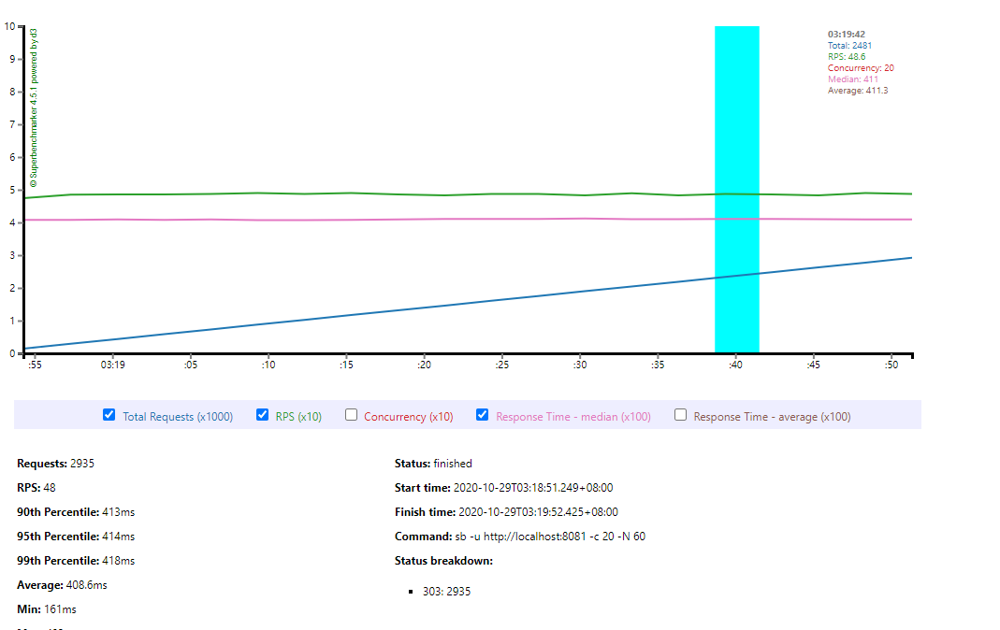
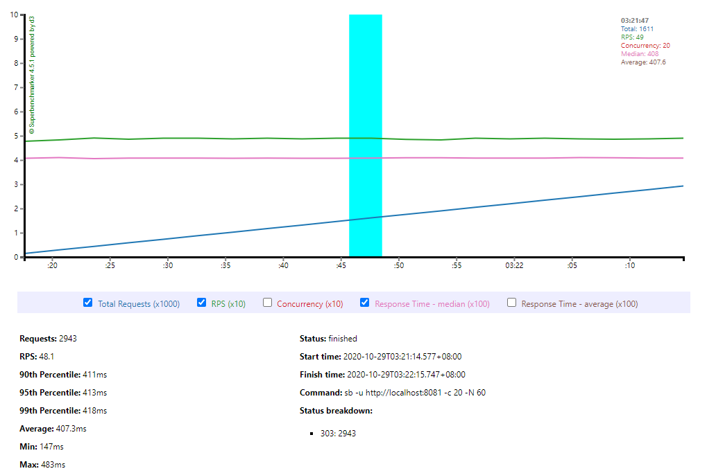
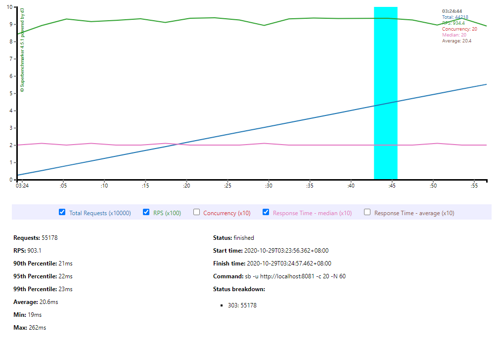
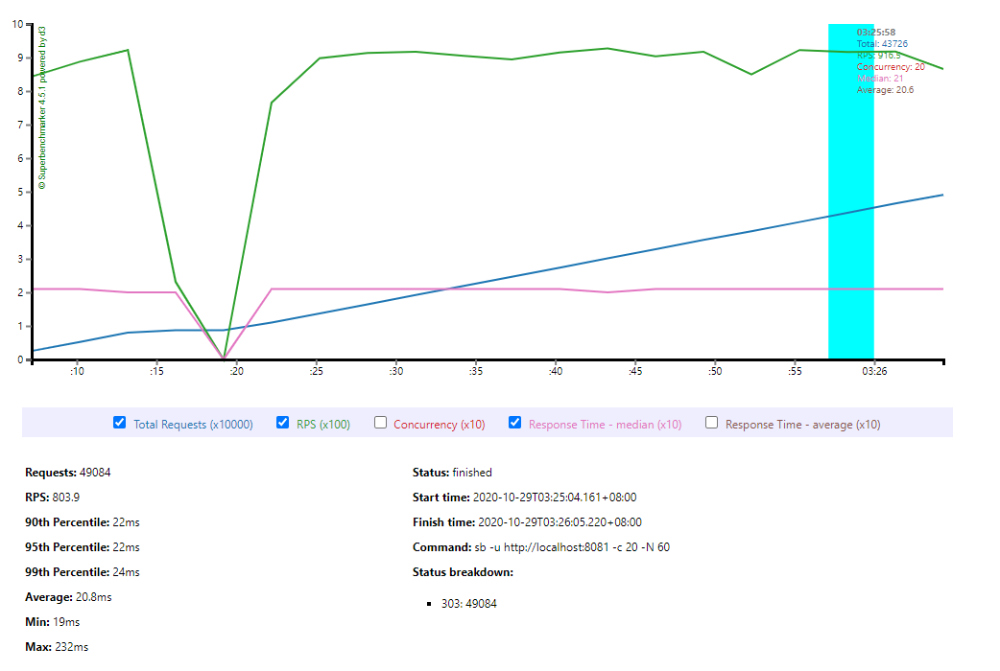
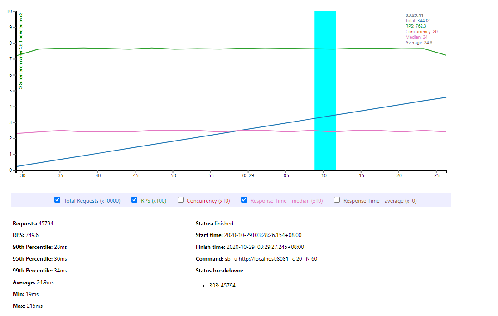
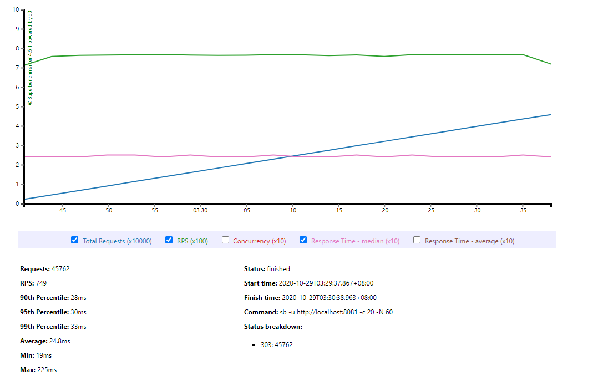
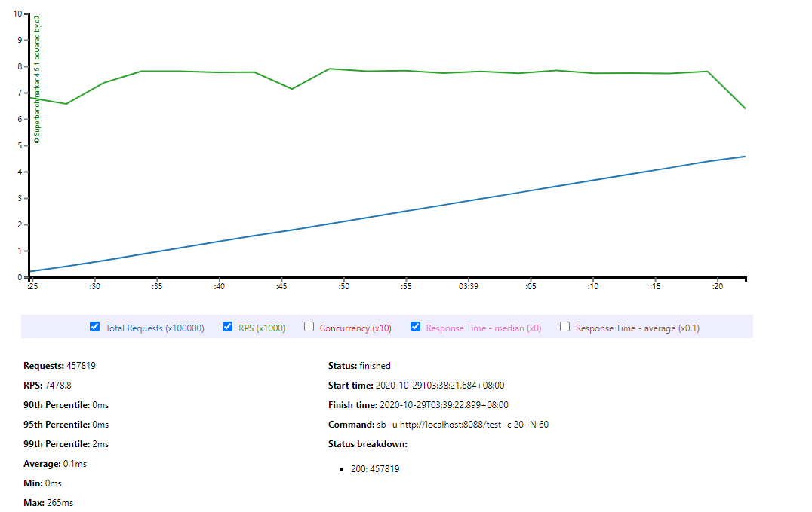
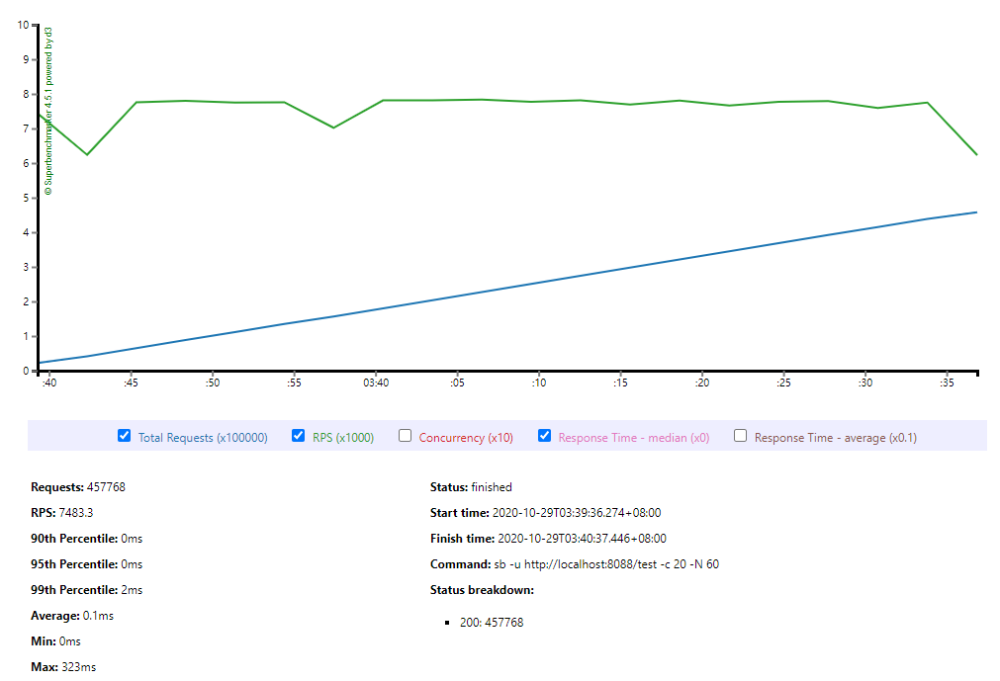

#  运行课上的例子，以及 Netty 的例子，分析相关现象 

## 单线程BIO

 测试命令

```
sb -u http://localhost:8081 -c 20 -N 60
```

测试结果1



测试结果2



| 次数 | RPS  | 最大响应时间（ms） | 最小响应时间(ms) | 平局响应时间(ms) |
| ---- | ---- | ------------------ | ---------------- | ---------------- |
| 1    | 48   | 483                | 161              | 408.6            |
| 2    | 48.1 | 483                | 147              | 407.3            |
| 平均 | 48   | 483                | 154              | 407.95           |

## 多线程BIO

测试结果1



测试结果2



| 次数 | RPS   | 最大响应时间（ms） | 最小响应时间(ms) | 平局响应时间(ms) |
| ---- | ----- | ------------------ | ---------------- | ---------------- |
| 1    | 903.1 | 262                | 19               | 20.6             |
| 2    | 803.9 | 232                | 19               | 20.8             |
| 平均 | 853.5 | 247                | 19               | 20.7             |

## 线程池BIO

测试结果1



测试结果2



| 次数 | RPS   | 最大响应时间（ms） | 最小响应时间(ms) | 平局响应时间(ms) |
| ---- | ----- | ------------------ | ---------------- | ---------------- |
| 1    | 749.6 | 215                | 19               | 24.9             |
| 2    | 749   | 225                | 19               | 24.8             |
| 平均 | 749.3 | 220                | 19               | 24.85            |

## Netty

测试结果1



测试结果2



| 次数 | RPS     | 最大响应时间（ms） | 最小响应时间(ms) | 平局响应时间(ms) |
| ---- | ------- | ------------------ | ---------------- | ---------------- |
| 1    | 7478.8  | 265                | 0                | 0.1              |
| 2    | 7483.3  | 323                | 0                | 0.1              |
| 平均 | 7481.05 | 294                | 0                | 0.1              |

## 总结

- 单线程BIO性能非常差，RPS=48左右，平均响应时间400+ms
- 直接new的多线程和线程池相差不大，线程池还要差一点，RPS在700-900，平均响应时间20-25ms。这里线程池不如直接new的原因：1、可能是我线程池大小没调好。2、可能例子台简单，无法体现线程池优势，而且线程本身可以预防虚拟机栈溢出，所以还是要用程池。
- netty性能相比BIO可以说是遥遥领先！RPS是多线程BIO的10倍将近，而平均响应时间更是只有后者的1/200。