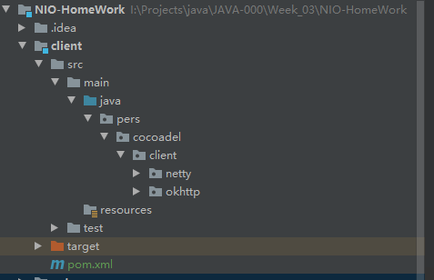
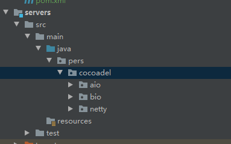
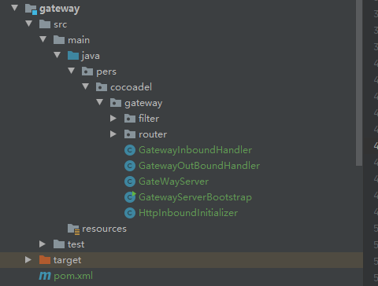
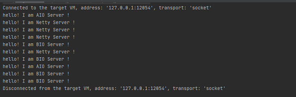
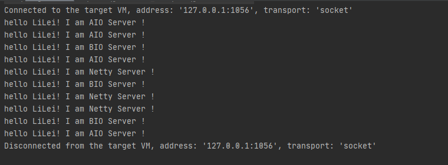

# 作业

**1.（必做）**整合你上次作业的 httpclient/okhttp；

**2.（选做）**使用 netty 实现后端 http 访问（代替上一步骤）

**3.（必做）**实现过滤器。
**4.（选做）**实现路由。

上面这的题目都整合在一起了，所以不分开说明了


### HttpClient

有两个实现：

- OkHttp实现，用在前端客户端访问
- Netty实现，用在网关访问被代理的服务器



### HttpServer

服务器一共有三个实现：

- 基于BIO实现
- 基于AIO实现
- 基于Netty实现



### Gateway

网关使用Netty实现，分别实现了：

- 代理上面三个服务
- 随机路由
- 请求过滤器



### 测试

##### 测试代理和随机路由

使用OkhttpClient循环访问网关，并且打印返回

OkhttpClient

```java
    /**
     * 网关访问测试
     * @param args
     * @throws IOException
     */
    public static void main(String[] args) throws IOException {
        String url = "http://localhost:8808/";
        OkHttpClient okHttpClient = new OkHttpClient();
        final Request request = new Request.Builder()
                .url(url)
                .build();
        for(int i = 0; i < 10;i++){
            final Call call = okHttpClient.newCall(request);
            Response response = call.execute();
            System.out.println(response.body().string());
        }
    }
```

  测试结果



可以看出被代理的三个服务器器被随机访问

##### 测试请求拦截器

拦截器在请求中添加请求头，key：nio，value：LiLei

```java
public class DefaultHttpRequestFilter implements HttpRequestFilter{
    @Override
    public void filter(FullHttpRequest fullRequest, ChannelHandlerContext ctx) {
        fullRequest.headers().add("nio","LiLei");
    }
}
```

后端服务器会获取该请求头值，并且拼到返回信息里，返回给客户端。

测试结果

