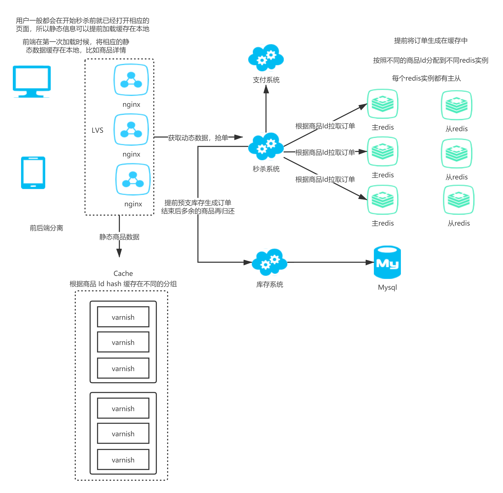

#  秒杀系统

## 前言

## 需求分析

### 卖端需求

- 提前注册参加秒杀活动的商品，自定义活动商品价格和数量
- 不能发生超卖，不能有收支错误
- 秒杀活动剩余的商品要准确归还商家库存

### 买端需求

- 能准时点击秒杀按钮，发送秒杀请求
- 请求能快速响应，不管成功还是失败
- 秒杀失败后，能继续点击秒杀按钮，直到商品被抢完。

### 非功能性需求

#### 稳定性

- 保证业务处理的正确性，不能发生支付，下档、库存等数据处理错乱。
- 保证业务服务在运行期间不能崩溃，要保证高可用。

#### 高性能

- 高吞吐：能接收和处理海量的用户请求。
- 低延迟：能在短时间内返回处理结果给用户，不管成功或者失败。

#### 系统保护

- 预热

- 降级
- 限流
- 拒绝服务

## 技术设计

### 前端 - 买家

- 前端静态资源文件：HTML文件，CSS，js，图片等通过 Nginx 做静态资源代理。
- 静态数据，例如商品详情，可以在第一次加载后缓存在前端，因为很多时候，参加秒杀的人都会提前加载页面，这时候用户刷新页面的时候，就直接取本地静态数据进行加载。
- 动态数据，比如秒杀商品剩余量，通过后端的 rsetful 接口获取。
- 防止机器人等恶意抢单。
- 前端负载秒杀活动倒计时。

### 前端 - 卖家

- 卖家页面要求比较简单，能在秒杀活动开始之前的一定时间内，注册参加活动的商品和相关信息。

## 技术选型

### 前端

使用前后端分离设计，前端使用vue作为框架开发，静态数据缓存在本地。

#### 反向代理

使用 LVS + Nginx 搭建高可用的反向代理集群，同时 Nginx 也是静态资源服务器。

#### 静态数据缓存

虽然静态数据会缓存到前端，但是这是不可控的。用户可以删除缓存，也有可能关闭缓存功能，或者因为一些其他原因本地缓存失效。所以对于静态数据的请求在 nginx 后面还要做一层缓存。

#### 业务网关

不使用业务网关：为了减少请求的转发路径，这里不使用业务网关，请求通过nginx后，如果是动态请求则直接进入秒杀系统处理。

#### 订单预分配到缓存

参加活动的商品会提前从库存预支，转换成订单预分配到 redis 集群中。

预订单按照商品 ID 的 hash 值，分配到不同的 redis 实例，每个 redis 实例都配有从实例。

#### 对接服务 

由于是直接预支库存，所以秒杀活动的过程中，不需要对接库存服务，只需对接支付系统。

## 架构图

